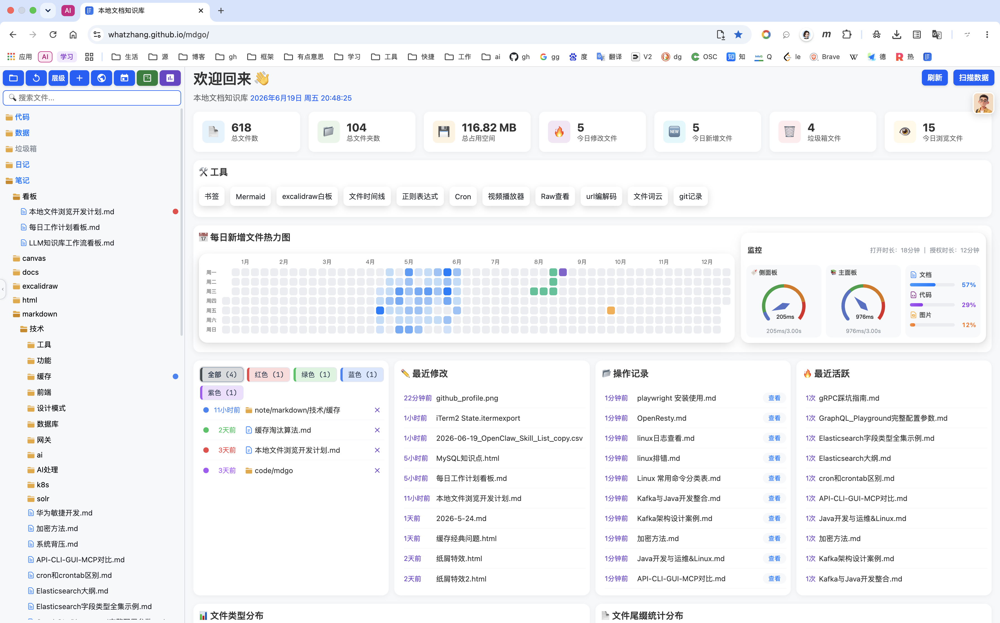

# mdgo - 本地文档知识库

一款轻量级本地知识库工具，支持 Markdown、HTML、思维导图、OPML 文档的预览编辑，提供丰富的文件格式支持、图表工具、系统监控和 AI 辅助功能。

 

## 文件格式支持

- `.md`: Markdown 文档，支持实时预览
- `.html`: HTML 页面预览与编辑
- `.csv`: CSV 表格文件
- `.pdf`: PDF 文件预览
- `.opml`: OPML 大纲文件
- `.txt`: 纯文本文件
- `.mm`: FreeMind 思维导图
- `.puml` / `.plantuml`: PlantUML 图表
- `.drawio`: Draw.io (diagrams.net) 图表
- `.excalidraw`: Excalidraw 手绘图表
- `.canvas`: 自定义画布文件
- `.mmd`: Mermaid 图表文件

## 工具功能

本工具集成了多种实用工具，包括：

- **Mermaid 图表**: 支持流程图、时序图、类图、状态图、甘特图、ER 图、用户旅程图、Git 图、思维导图、饼图、时间线、看板、四象限图、桑基图、XY 图表、块状图、架构图、数据包图等多种图表类型。
- **GraphiQL**: GraphQL API 测试工具。
- **OpenResty**: OpenResty 配置编辑器。
- **正则表达式测试**: 提供正则验证与测试功能。
- **Cron 表达式解析**: 可视化展示 Cron 表达式。
- **视频播放器**: 支持多种格式，并具备记忆播放功能。
- **图片浏览器**: 提供缩放和预览功能。
- **书签管理**: 支持导入浏览器书签 HTML 文件。
- **Excalidraw 白板**: 手绘风格的协作白板。
- **文件时间线**: 可视化展示文件的修改历史。
- **URL 编解码**: URL 编码/解码工具。
- **文件词云**: 根据文件内容生成词云图。
- **Git 记录**: 用于查看 Git 提交历史。
- **日历**: 集成了日程管理功能。
- **看板**: 提供 Obsidian 风格的看板视图。
- **AI 功能**:
  - 总结、分析、排版：可分析文件内容和解释代码含义。
  - 图表生成：能根据描述自动生成 draw.io / Excalidraw 图表。

## 使用说明

用户可以通过以下两种方式启动和使用项目：

1.  **方法一（本地运行）**: 下载项目代码后，启动 `backend/main.py` 文件，然后在浏览器中打开 `http://localhost:8091`。
2.  **方法二（直接访问）**: 直接在浏览器中打开 `index.html` 或 `index_cdn.html`。

> **注意：**
>
> - `index.html` 依赖本地的 CSS/JS 文件，适用于无网络环境使用。
> - `index_cdn.html` 依赖网络 CDN，必须具备网络连接才能使用。

## 技术栈

项目使用了以下技术组件：

- **代码编辑器**: Monaco Editor
- **图表库**: ECharts
- **文档解析**: marked.js
- **语法高亮**: highlight.js
- **思维导图**: jsMind
- **图表渲染**: Mermaid, PlantUML, D3.js
- **视频播放**: ArtPlayer (支持 HLS/DASH/FLV)
- **PDF 预览**: pdf.js
- **表格处理**: SheetJS (xlsx)
- **时间处理**: moment.js
- **时间线**: vis-timeline
