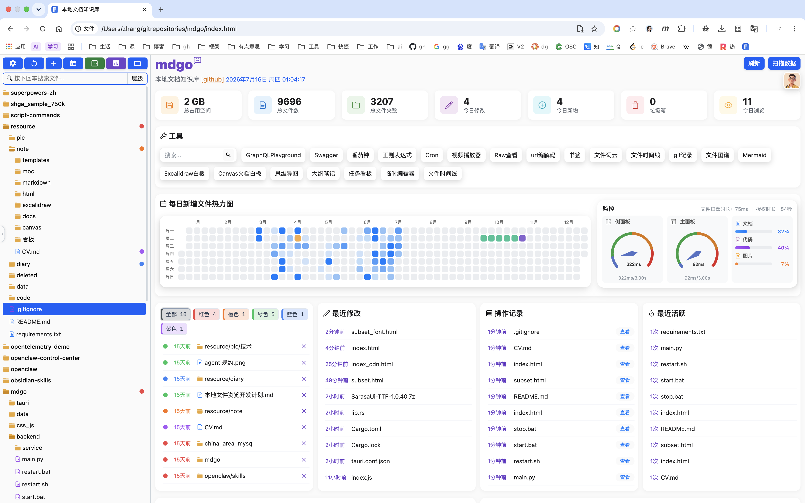

# 📚 mdgo · 本地文档知识库

**一款轻量级的本地知识库工具，把 Markdown、图表、图片、思维导图、白板、大纲、Git、日历、看板、AI 功能（简单AI辅助）全部装进一个浏览器标签页。**

  

### 使用说明

1. 直接访问（推荐）：[https://whatzhang.github.io/mdgo/](https://whatzhang.github.io/mdgo/)
2. 直接浏览器打开  
   - `index.html` → 依赖本地 js/css 文件
   - `index_cdn.html` → 依赖网络 CDN
3. 本地运行：启动后端服务 `backend/main.py`，然后访问 `http://localhost:8091`
4. 打包应用 
    - Linux/macOS: `tauri/build.sh build`  
    - Windows: `tauri/build.bat build`  
   安装包输出路径：`tauri/src-tauri/target/release/bundle`

### 功能与工具

- Mermaid 图表：支持流程图、时序图、类图、状态图、甘特图、ER 图、用户旅程图、Git 图、思维导图、饼图、时间线、看板、四象限图、桑基图、XY 图表、块状图、架构图、数据包图等
- draw.io 图表：支持 draw.io 图表预览与编辑
- Excalidraw 白板：手绘风格的协作白板
- 图谱：显示目录文件、文档关联关系图谱
- 文件时间线：可视化展示文件的修改历史
- 文件词云：根据文件内容生成词云图
- GraphiQL：GraphQL API 测试工具
- OpenResty：OpenResty 配置编辑器
- Swagger：Swagger API 文档编辑器
- 正则表达式测试：提供正则验证与测试功能
- Cron 表达式解析：可视化展示 Cron 表达式
- URL 编解码：URL 编码/解码工具
- Git 记录：查看 Git 提交历史
- 视频播放器：支持多种格式，并具备记忆播放功能
- 图片浏览器：提供缩放和预览功能
- RAW 照片查看：支持查看 RAW 格式的照片
- 书签预览：支持预览浏览器书签 HTML 文件中的链接
- 日历日程：集成日程管理功能
- 看板：提供看板视图，管理任务
- 大纲：支持 OPML outline 大纲文件
- 总结、分析、排版：可分析文件内容和解释代码含义
- 图表生成：能根据描述自动生成 draw.io / Excalidraw 图表